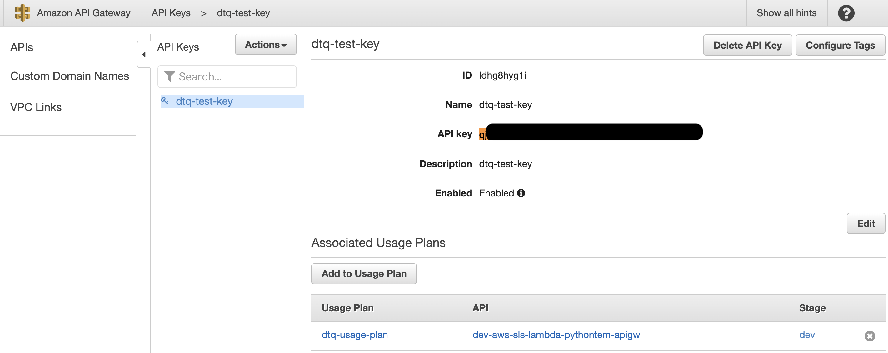

# aws-sls-lambda-pythontem-apigw-secure 🐳


[](https://github.com/tquangdo/aws-sls-lambda-pythontem-apigw-secure/issues/new)


1. ## reference
    [youtube](https://www.youtube.com/playlist?list=PLxzKY3wu0_FJuyy7dUn5unlWmM7QuPo6e)

1. ## link repo
    [github](https://github.com/tquangdo/aws-python-sls-lambda-apigw-simple-json)

1. ## init
    ```shell
    sls create --template aws-python3
    # want to see template list: `sls create --help`
    # `aws-python3` is python's version=3.8. version=2.7 is `aws-python`
    ->
    Serverless: Successfully generated boilerplate for template: "aws-python"
    ```
    - edit `serverless.yml`:
    ```yaml
    stage: dev
    region: us-east-1
    ```
    - deploy
    ```shell
    sls deploy
    ->
    Serverless: Stack update finished...
    Service Information
    service: aws-sls-lambda-pythontem-apigw-secure
    stage: dev
    region: us-east-1
    stack: aws-sls-lambda-pythontem-apigw-secure-dev
    resources: 6
    api keys:
    None
    endpoints:
    functions:
    hello: aws-sls-lambda-pythontem-apigw-secure-dev-hello
    layers:
    None
    ```
    
    -
    
    ```shell
    sls invoke --function hello # OR `sls invoke local --function hello`
    ->
    {
        "statusCode": 200,
        "body": "{\"message\": \"Go Serverless v1.0! Your function executed successfully!\", \"input\": {}}"
    }
    ```

1. ## api gateway
    - start coding `handler.py > dtqSearch()` & `serverless.yml > dtqSearch`
    - deploy
    ```shell
    sls deploy
    ->
    Serverless: Stack update finished...
    Service Information
    service: aws-sls-lambda-pythontem-apigw
    stage: dev
    region: us-east-1
    stack: aws-sls-lambda-pythontem-apigw-dev
    resources: 16
    api keys:
    None
    endpoints:
    GET - https://ngv7fe48i7.execute-api.us-east-1.amazonaws.com/dev/results
    POST - https://ngv7fe48i7.execute-api.us-east-1.amazonaws.com/dev/query
    functions:
    hello: aws-sls-lambda-pythontem-apigw-dev-hello
    dtqSearch: aws-sls-lambda-pythontem-apigw-dev-dtqSearch
    layers:
    None
    ```
    

1. ## check result
    ### GET
    -  access `https://ngv7fe48i7.execute-api.us-east-1.amazonaws.com/dev/results?query=dtq` on browser will have result:
    ```json
    {
        message: "your query is: dtq"
    }
    ```
    ### POST
    #### 1)
    ```shell
    curl -d '{"country": "VN"}' -H "Content-Type: application/json" -X POST https://ngv7fe48i7.execute-api.us-east-1.amazonaws.com/dev/query
    ->
    {"message": "received your body text", "msgBody": "{\"country\": \"VN\"}"}
    ``` 
    #### 2)
    

1. ## api gateway secure
    - click `Resources` > `POST` > `Method Request` > API Key Required=`true` > click `Deploy API` > choose stage=`dev`
    
    - POST again and result will be `Forbidden`
    ```shell
    curl -d '{"country": "VN"}' -H "Content-Type: application/json" -X POST https://ngv7fe48i7.execute-api.us-east-1.amazonaws.com/dev/query
    ->
    {"message":"Forbidden"}
    ```
    - click `API Keys` > Actions=`Create API Key` > Name=`dtq-test-key`
    
    - click `Usage Plans` > `Create` > Name=`dtq-usage-plan` > `Next`
    
    - click `Add API Stage` > API=`dev-aws-sls-lambda-pythontem-apigw` > Stage=`dev` > check ☑️
    
    - click `Add API Key to Usage Plan` > Name=`dtq-test-key` > check ☑️ > `Done`
    
    - back to api key=`dtq-test-key` (already added plan=`dtq-usage-plan`), click API key `show`, copy key and paste into POST API header -> POST OK!
    
    -
    

